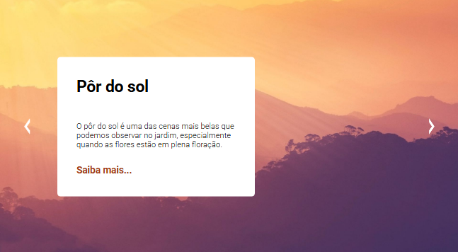
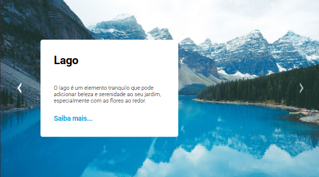
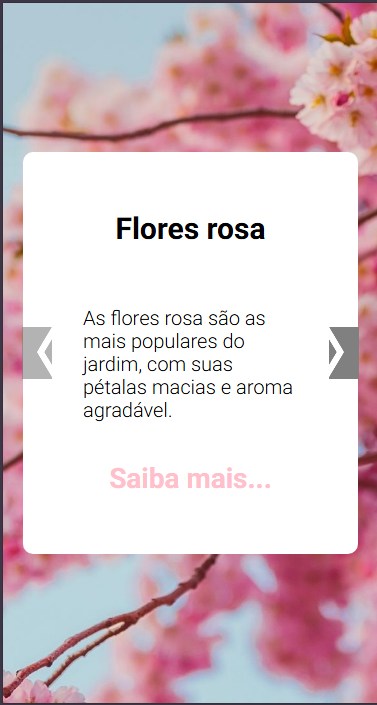
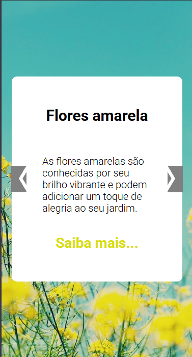
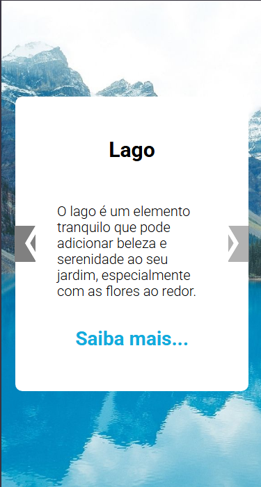

# Slider

<b>Este projeto é o resultado de um exercício do módulo de JavaScript, proposto pelo curso DevQuest.

## Visão Geral 

###  Projeto 

<b> O objetivo é desenvolver uma página com estrutura do tipo Slider, como interação para alterar os itens.

###  Desafio

<b>O desafio consiste em desenvolver uma página a partir dos designs fornecidos, com estrutura do tipo Slider, que é um carrossel de imagens com uma sessão de conteudo de informações. Os itens devem altear ao clicar nos icones de setas.

### Funcionalidades 
<ul>
<li>Ao clicar nos icones de setas (para direita e para esquerda), as imagens com a sessão de conteudo de informações devem alterar.</li>
</ul>

### Capturas de tela 

Preview:  
  1 - Flores Rosa:   
    
  2 - Flores Amarelas: 
   
  3 - Pôr do sol: 
   
  4 - Lago: 
    

Preview - mobile:  
  1 - Flores Rosa:   
  
    
  2 - Flores Amarelas: 
  
   
  3 - Pôr do sol:  
  
   
  4 - Lago: 
   
   
  
   

### Links 
 
<ul>
<li><a href="https://github.com/fernanda-nunes/slider" target="_blank"> Repositórios</a></li>
<li><a href="https://fernanda-nunes.github.io/slider/" target="_blank"> Site ao vivo</a></li>
</ul>
 

## O que eu aprendi 

<b> Durante o desenvolvimento deste projeto, tive a oportunidade de consolidar e expandir minhas habilidades em desenvolvimento front-end.